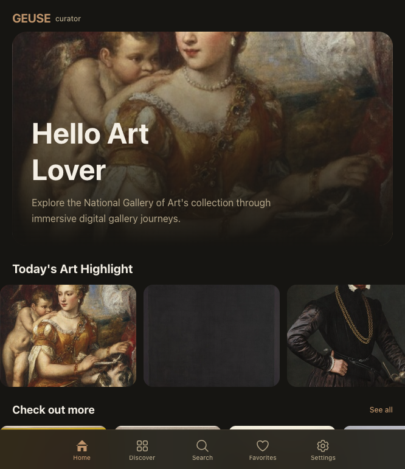

# 🎨 GEUSECurator

AI-powered search and curator experience for the National Gallery of Art collection.

## 🌐 Live Site

https://www.geuse.io/curator/

## 🧭 About (Frontend)

An enterprise-grade AI platform for discovering and exploring the National Gallery of Art's collection through semantic search, multimodal retrieval, and conversational AI.

### ⚙️ Data Pipeline & ETL

Automated ingestion pipeline processes NGA open data CSVs, filters artworks with images, and transforms structured metadata into semantic embeddings. Python-based ETL feeds n8n orchestration workflows for scalable, batch processing.

### 🧠 Vectorization & Semantic Storage

Dual-database architecture: PostgreSQL stores structured metadata (title, artist, dates, classification) while Qdrant indexes 768-dimensional embeddings via `nomic-embed-text`. Enables semantic similarity search across ~160,000 artworks with sub-second query performance.

### 💬 AI Models & Multimodal Search

Natural language processing via `llama3.2:3b` for conversational Q&A. Optional computer vision analysis with `llava` for image description and metadata enrichment. Embeddings power information retrieval, recommendation systems, and knowledge graph construction.

### 🏗️ Enterprise Architecture

React 19 frontend (static SPA on AWS S3) communicates with an n8n workflow orchestration layer. RESTful API microservices handle search, chat, and ingestion. GPU-accelerated inference (Tesla T4) enables real-time semantic search and interpretable AI responses.

### 🔒 Open Source & Self-Hosted

Built entirely with open-source tools: Ollama (self-hosted LLM inference), PostgreSQL, Qdrant, and n8n. Zero outbound API calls to external providers. All AI processing runs on-premises for data privacy, cost control, and system autonomy.

## 🏛️ NGA Data Resource Notes

- Powered by the National Gallery of Art Open Data Program.
- All artwork images courtesy of the National Gallery of Art, Washington, D.C.
- Official NGA GitHub organization: https://github.com/NationalGalleryOfArt
- NGA Open Data repository: https://github.com/NationalGalleryOfArt/opendata
- NGA Open Access Images: https://www.nga.gov/open-access-images.html

## 🤝 Collaborator

National Gallery of Art: https://github.com/NationalGalleryOfArt
